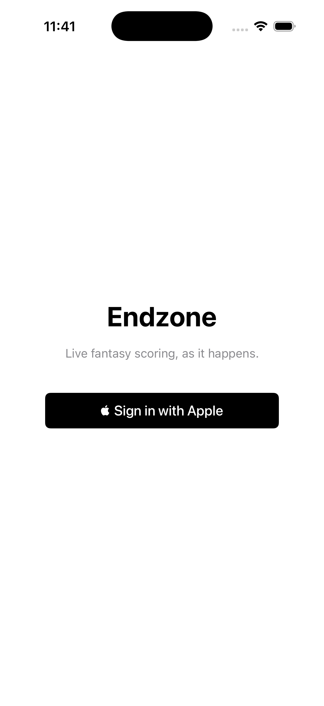
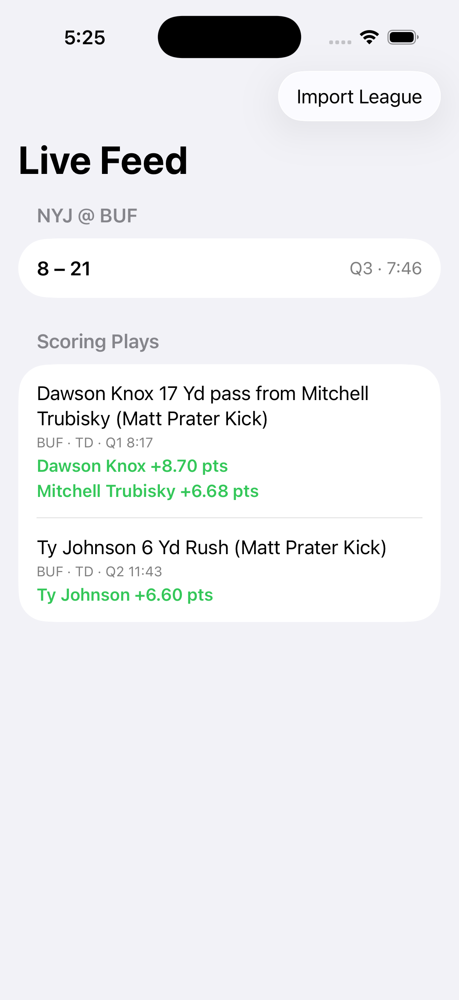
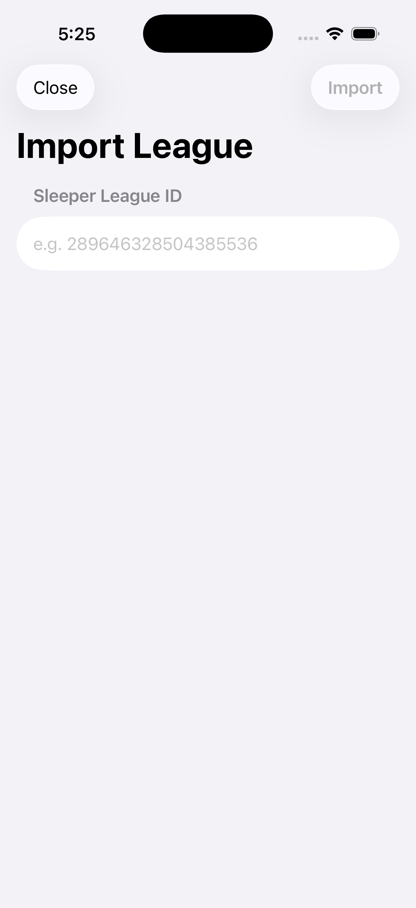

# Endzone

Fantasy football live-feed iOS app — real NFL scoring plays turned into personalized fantasy-point push notifications. A portfolio project: full-stack (SwiftUI + AWS serverless), built with a strict "verify against real data, never guess" discipline throughout.

<p float="left">
  
  
  
</p>

## What it does

A user signs in with Apple, imports their Sleeper fantasy league, and watches their tracked NFL game as a live feed — every scoring play shown with real per-player fantasy points, computed against their league's actual scoring settings, not a generic estimate. Push notifications carry the same personalized points for when the app isn't open.

## Architecture, briefly

```
checker Lambda (EventBridge, ~15min)
  → detects a live game via Tank01
  → starts a Step Functions execution
      → poller Lambda loops every 90s (Step Functions Wait state)
          → diffs new scoring plays, enriches via ESPN, persists to DynamoDB, publishes to SQS
              → push Lambda computes personalized points per subscriber, calls APNs

API Gateway (Sign in with Apple JWT auth)
  → GET /live-game: same stored, ESPN-enriched state, points computed personalized to whoever's asking
  → POST /leagues, PUT /device-token: the write side (import a league, register for push)
```

iOS: SwiftUI + SwiftData, Sign in with Apple, stubbed against fake data (no live backend deployed — see [Status](#status)). Backend: Python Lambdas behind AWS SAM, deployable but not currently running.

## What's actually interesting here

A few decisions worth asking about in an interview:

- **The data provider changed three times**, each pivot driven by hitting the real API rather than trusting docs: API-Football turned out to be soccer-only, API-American-Football's listing was a dead link, SportAPI7's free tier was 50 requests/*month* (unusable). Landed on Tank01, verified live before building anything around it.
- **Step Functions instead of a second EventBridge rule** for the 90-second poll loop — EventBridge's native scheduling bottoms out at 60s, so a `Wait` state does the sub-minute timing instead.
- **Fantasy points are a 3-provider pipeline**: Tank01 detects the play, ESPN's unofficial API supplies structured yardage and play-type (verified live against 4 real games, not assumed), Sleeper supplies the league's real scoring rates. Points are computed *per push subscriber* in the delivery Lambda, not once upstream — different leagues score the same play differently.
- **Sign in with Apple auth needs zero custom verification code** — API Gateway's native JWT authorizer checks the identity token against Apple's public JWKS directly; the Lambda just trusts the verified claim.
- **Real bugs found via testing, not by luck**: a two-point-conversion play that fooled category-based role attribution (a receiver and a conversion target both looked like "the scorer"), a snake_case/camelCase mismatch between the iOS client's assumptions and the backend's actual wire format, and an identity token that was being captured and silently discarded. All caught by tests built against real fixture data, not synthetic examples.
- **A gap that testing couldn't catch, because it wasn't a bug** — the push notification computed real personalized points from day one, but the live feed screen (what the user actually opens) had no way to show them at all: no read endpoint existed, and the stored game state didn't retain what it'd need to compute points on demand. Passing tests don't catch a missing feature; only asking "does this actually do what I wanted" does.

## Status

**Portfolio/demo project, not deployed.** The backend is real, deployable infrastructure (SAM template, scoped IAM policies, a cost guardrail) because designing it that way is itself the point — but running it live isn't required to see it work. The iOS app runs fully in Simulator against stubbed data.

## Running it

**Backend** (Python 3.13):
```
cd backend
python3 -m venv .venv && .venv/bin/pip install -r requirements.txt
.venv/bin/python -m pytest        # 59 tests, no AWS credentials needed
sam validate --lint && sam build  # confirms the infra is real and deployable
```

**iOS** (Xcode 16+, iOS 17+ simulator):
```
cd ios
open Endzone.xcodeproj          # or: xcodebuild -project Endzone.xcodeproj -scheme Endzone -destination 'platform=iOS Simulator,name=iPhone 17' build
```
Real Sign in with Apple in Simulator needs an Apple ID signed into the Simulator itself (Settings → Sign in to your iPhone) and can hang mid-flow regardless — a known Simulator limitation, not an app bug. To skip straight to the live feed, tap **Continue as Demo User** on the sign-in screen (DEBUG builds only; see `AuthManager.swift`).
